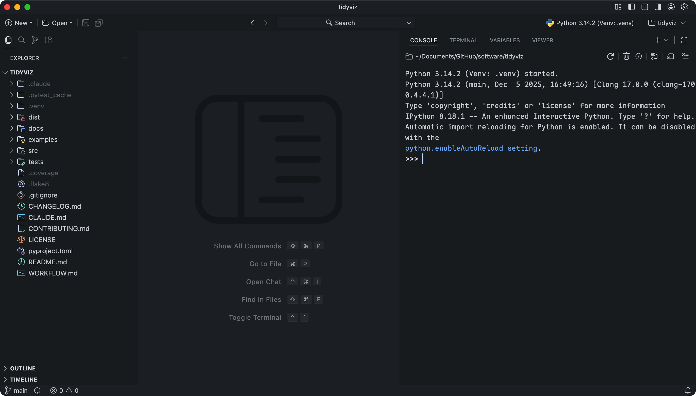
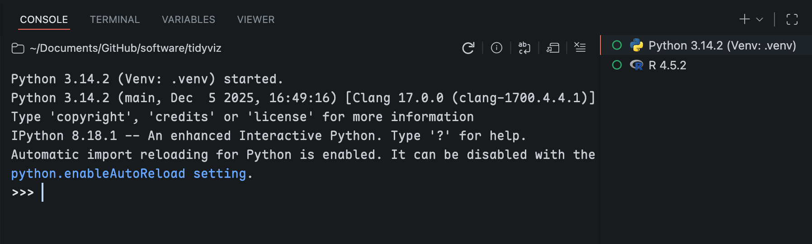
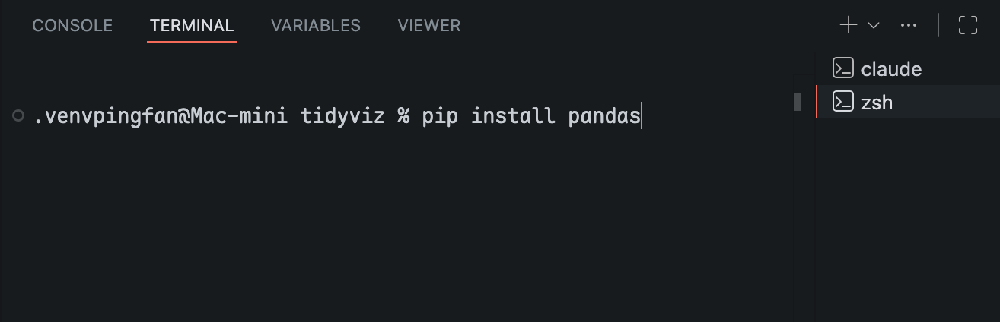
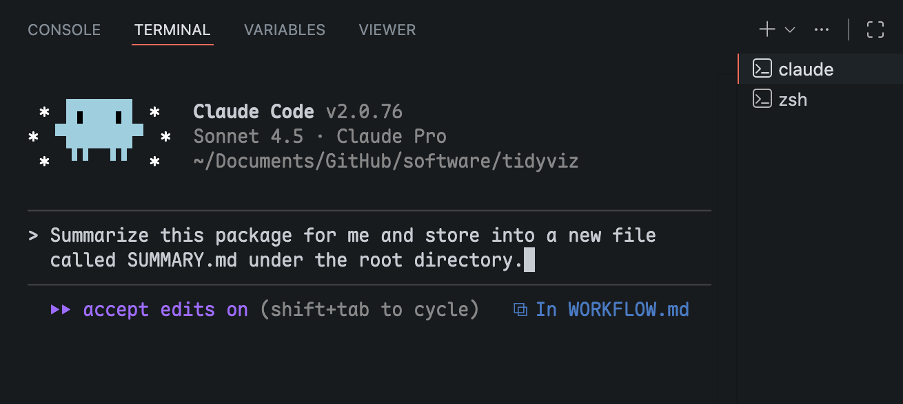
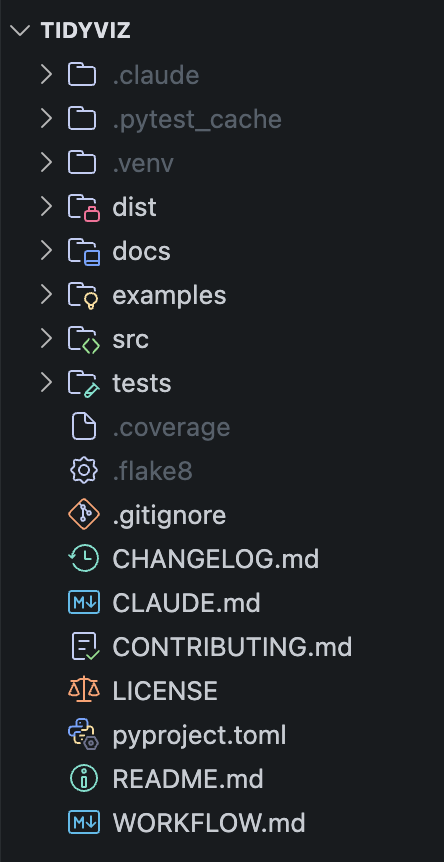

## Motivation

Why do we still need to learn software development now that we have LLMs? This has been a question raised by many developers. For me, the easy access to AI tools is exactly the reason why development skills are more important than ever.

The [URSSI](https://urssi.us) Winter School is a 3-day bootcamp hosted by Oregon State University in Portland, OR. I was fortunate to attend this event in December 2025 and benefited from the excellent lectures by professor [Kyle Niemeyer](https://engineering.oregonstate.edu/people/kyle-niemeyer), professor [Madicken Munk](https://engineering.oregonstate.edu/people/madicken-munk), and Dr [Joanna Piper Morgan](https://jpmorgan98.github.io).

The bootcamp focused on the full workflow of Python development, from writing code to testing, documentation, version control, and deployment. I mainly use R for data analysis, thus having R packages as my RSE products, like [`surveydown`](https://pingfanhu.com/projects/2024-surveydown/) and [`sdstudio`](https://pingfanhu.com/projects/2025-sdstudio/). This bootcamp benefited me for two reasons: 1) It expanded my skills in Python as a popular programming language; 2) RSE development for different programming languages shares many common principles.

## Introduction

With readily available LLM tools like ChatGPT, Claude, and Gemini, things seem to be easier than ever. It seems like everyone can create designs, write code, generate images, and more. However, the reality is that there remains a significant barrier for those without professional training, even with AI tools at their disposal. In software development, there is a term called "technical debt" which refers to the hidden costs resulting from careless deployment with generative AI in the long run [@anderson_hidden_2025]. Therefore, it is essential to establish a solid foundation of software development principles before leveraging AI tools.

::: {.callout-note}
This blog post is based on macOS showcasing both Python and R coding examples.
:::

## IDE

The working environment is the first thing to consider. A good IDE (Integrated Development Environment) can significantly boost productivity. Here are my recommendations:

- [Positron](https://positron.posit.co): Positron is a modern IDE published by Posit and is my favorite. It's a VS Code-based IDE and has great support for both Python and R with lots of tailored features for data science.
- [VS Code](https://code.visualstudio.com): The best general-purpose IDE. It has a rich ecosystem of extensions for almost any programming language and task.
- [RStudio](https://posit.co/download/rstudio-desktop/): Mature IDE for R programming.
- [PyCharm](https://www.jetbrains.com/pycharm/): Mature IDE for Python programming.

Other than IDEs, you can also use text editors like [Sublime Text](https://www.sublimetext.com) or [Vim](https://www.vim.org), in which case you need to have a separated Terminal session ready. One good reason for using IDEs is that they often have integrated terminal support, so you don't need to switch between windows.

## Language Installation

Python can be directly installed through homebrew:

```bash
brew install python
```

After installation, you can set `python` and `pip` as aliases for `python3` and `pip3`, respectively.

R can be installed through CRAN using [this link](https://cran.rstudio.com).

::: {.callout-tip}
Both Python and R can be directly executed in Terminal with commands `python` and `R`, respectively. In IDEs, the Python or R language session is called **"Console"**, distinguished from **"Terminal"** which is a shell session. During your development, you might frequently switch between Console and Terminal.
:::

## Package Management

### Python

::: {.callout-tip}
Every Python project should have its own **virtual environment** to manage dependencies.
:::

Recent Python versions prevent global package installation due to version conflicts -- a common issue in Python development. Therefore, a **virtual environment** is needed for each project. The simplest way is to leverage the built-in `venv` module.

Open your Python project root directory in your IDE and get started.

Firstly, in your **Terminal**, run this to create a virtual environment named `venv`. You only need to do it once per project:

```bash
python3 -m venv .venv
```

Then, activate the virtual environment:

::: {.callout-tip}
For Positron, you don't need to activate the environment manually as long as you have the correct interpreter selected. You'll see a `.venv` before your terminal prompt. If you don't see it, relaunch your Terminal.
:::

```bash
source .venv/bin/activate
```

Great! Now you are done with the setup and can start calling `pip` to install packages locally within this virtual environment, for example:

```bash
pip install pandas
pip install numpy
# etc.
```

### R

R is a lot simpler thanks to [CRAN](https://cran.r-project.org). You can safely install R packages globally with the `install.packages()` function in your **R Console**.

::: {.callout-tip}
Note that we use R Console instead of Terminal here. But if you prefer Terminal, you can run R in Terminal by simply typing `R`.
:::

For example:

```r
install.packages("tidyverse")
```

The other way is to directly install packages from GitHub using the `pak` package. Here is an example of installing the development version of `surveydown`:

```r
# install.packages("pak")
pak::pak("surveydown-dev/surveydown", ask = FALSE)
```

## The Development

In the pre-LLM era, the actual development was the most time-consuming part. This remains true with the help of LLMs, but it is slightly different since developers can now focus on higher-level design and logic, while leaving the repetitive coding tasks to AI tools.

Therefore, having a solid understanding of the development workflow is crucial, including the directories structure, testing, documentation, version control, and deployment.

### Python Package Structure

I'll use my [`tidyviz`](https://pingfanhu.com/projects/2025-tidyviz/) Python package as an example. This was created during the URSSI bootcamp. Here is a simplified structure of the package:

```bash
tidyviz
├── docs
│   ├── QUICK_START.md
│   └── USER_MANUAL.md
├── examples
│   ├── example_tidy.py
│   ├── example_viz.py
│   └── sample_survey_data.csv
├── src
│   └── tidyviz
│       ├── tidy
│       ├── viz
│       └── __init__.py
├── tests
│   ├── test_tidy
│   │   ├── test_reshape.py
│   │   └── test_validate.py
│   └── test_viz
│       ├── test_categorical.py
│       └── test_themes.py
├── CHANGELOG.md
├── LICENSE
├── pyproject.toml
└── README.md
```

This is a typical (and minimum) structure of a Python package. The main code is under the `src/tidyviz/` directory, with submodules `tidy/` and `viz/`. These are the core of the package. Python supports submodules, so it's a good practice to separate them. In my case, that's the `tidy` and `viz` submodules. The import command would be like:

```python
# Import the complete package
import tidyviz as tv

# Import specific submodules
from tidyviz import tidy
from tidyviz import viz
```

The `docs/`, `examples/`, and `tests/` directories are all self-explanatory. The root directory contains metadata files like `README.md`, `CHANGELOG.md`, `LICENSE`, and `pyproject.toml` which is the configuration file for building and packaging the Python package.

### R Package Structure

Our [`surveydown`](https://pingfanhu.com/projects/2024-surveydown/) R package is well-structured and can be used as an example:

```bash
surveydown
├── inst
│   ├── css
│   ├── ...
│   └── CITATION
├── man
│   ├── sd_add_page.Rd
│   ├── ...
│   └── sd_version.Rd
├── pkgdown
│   ├── favicon
│   └── _pkgdown.yml
├── R
│   ├── config.R
│   ├── db.R
│   ├── messages.R
│   ├── server.R
│   ├── ui.R
│   └── util.R
├── tests
│   └── testthat.R
├── vignettes
├── DESCRIPTION
├── LICENSE
├── NAMESPACE
├── NEWS.md
└── README.md
```

The main code directory for an R package is `R/`. The `inst/` directory contains additional resources like CSS and JS files, as well as examples, templates, etc. The `pkgdown/` directory is used for building the package website with the `pkgdown` package. The `man/` directory is auto-generated during the building process, extracting the `roxygen2` documentation from the R scripts. The `tests/` directory contains the test scripts, and `vignettes/` contains long-form documentation.

## Version Control

Speaking of version control, **Git** is the de facto standard. Professional developers emphasize that Git is different from GitHub, and will usually start from the `git` commands. This is beneficial for CLI lovers, but it doesn't hurt to have a GUI if you want to have a quicker start.

So, yes, these 3 are different:

1. [Git](https://git-scm.com): The version control system, starting with the `git` command in your Terminal, whose common commands include `git init`, `git add`, `git commit`, `git push`, etc.
2. [GitHub](https://github.com): A web-based platform for hosting Git repositories, owned by Microsoft. An interesting fact about GitHub as the largest open-source platform is that GitHub itself is not open-source.
3. [GitHub Desktop](https://github.com/apps/desktop): A GUI application for managing Git repositories hosted on GitHub.

My take is that understanding the differences between these three tools is less critical when you are starting out. I recommend beginning with GitHub Desktop if you are new to version control, and then gradually learning the `git` commands in Terminal as you become more familiar with the workflow. I have been doing RSE development for three years primarily using GitHub Desktop.

Start by using GitHub as a "manual" iCloud or OneDrive: it is an online backup of your code, which is one of the primary benefits of using GitHub. Every time you reach a milestone, just commit and push your code to GitHub. You can always go back to previous versions if needed. At this point, you mostly use the `main` branch.

When you are more comfortable, you can start exploring branching and pull requests. This is especially useful when you are collaborating with others. The typical workflow is to create a new branch for each feature or bug fix, make changes in that branch, and then create a pull request to merge the changes back into the `main` branch after review.

**Issues** and **Discussions** are also useful features of GitHub for project management and communication among collaborators. Issues are bound to one repo, while Discussions are more general and can be used across multiple repos within an organization. For example, our `surveydown` package has its own [Issues](https://github.com/surveydown-dev/surveydown/issues) page, while the [Discussions](https://github.com/orgs/surveydown-dev/discussions) page is for the whole surveydown-dev organization.

## My Personal Tips

Personalization is the key to productivity, and I bet everyone has their own tips and tricks. I'd like to share some of mine in this section, including Positron customization, LLM settings, and some other tips.

### IDE Customization

Positron is my favorite IDE which supports both R and Python. It's VS Code-based and supports VS Code-like user settings, extensions, and keybindings. Spend some time with the `settings.json` file or summon the settings page to configure to your own preferences.

My Positron layout is shown below. It has primary side bar located on the left side, main panel in the middle, and secondary side bar on the right. I don't use bottom panel.

<center>

<p><em>My Positron Layout</em></p>
</center>
<br>

The secondary side bar has both Console and Terminal:

<center>

<p><em>Console for Python and/or R Language Processing</em></p>
</center>
<br>

<center>

<p><em>Terminal of Shell Commands</em></p>
</center>
<br>

### LLM Settings

I mainly use Claude Code but I have heard Codex and Gemini are also good options. Here I demonstrate Claude Code as an example. Vibe Coding is now much easier with these CLI tools integrated into IDEs. They serve as assistants to your coding experience, so you can focus more on high-level design and logic, leaving the coding details to AI, which is what they excel at.

Simply call `claude` in a Terminal session within your IDE to start a conversation:

<center>

<p><em>Terminal of Claude Code - Essential for Vibe Coding</em></p>
</center>
<br>

### Other Tips

**The `WORKFLOW.md` file**

I recommend having a `WORKFLOW.md` file in the root directory of every project. For example, a Python project might have the following workflow:

1. Virtual environment setup
2. Virtual environment activation/deactivation
3. Package installation
4. Installing the working package in "editable" mode
5. Testing
6. Formatting and linting
7. Documentation
8. Pre-releasing to PyPI Test
9. Releasing to PyPI

Most of these steps are repetitive, thus the `WORKFLOW.md` file. This is both for developers and LLMs to follow.

**LLM Prompting**

Starting with "You are a professional in Python/R development who knows the industry standard RSE development workflow..." usually helps set the context for LLMs to better assist you.

LLMs tend to be verbose, so you can write down your requirements in your `WORKFLOW.md` file, something like: "If the function is self-explanatory, don't leave comments."

**Fonts, Themes and Cosmetics**

These are less important but they improve your overall experience. Here are the resources I have been using and found effective:

1. Font: [Maple Mono](https://font.subf.dev/en/)
2. Theme (as extension): [GitHub Theme](https://open-vsx.org/extension/GitHub/github-vscode-theme)
3. Icons (as extension): [Catppuccin Icons for VSCode](https://open-vsx.org/extension/Catppuccin/catppuccin-vsc-icons)

<center>

<p><em>Explorer with Catppuccin Icons</em></p>
</center>
<br>
