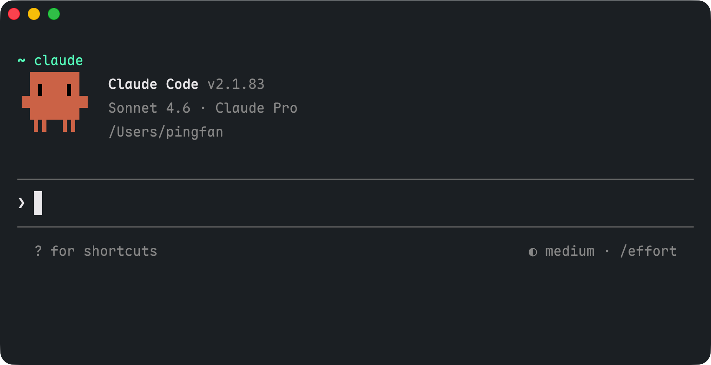

## Motivation

The speed of AI development is overwhelming. Every morning I wake up to news of AI improvements and I don't even have the time to learn and catch up.



I'm both panicked and excited about AI: for how it overthrows the current software landscape, and how we could use it more efficiently. After a lot of struggling and experimenting, I have come to a conclusion: the real edge isn't building apps for others — it's building workflows for yourself. I'm not sure how AI changes the tech market in the future, but at least for now, I can definitely leverage AI for a workflow tuned to my own needs.

## AI Assistants vs AI Agents

New terms emerge quickly: Vibe Coding, Agentic Engineering, and now Harness Design. These are all trending terms that appear for solid reasons, but before everything, I wanna talk about "AI Assistants" and "AI Agents" since they are the most basic and fundamental concepts.

**AI Assistants** are limited to a single prompt and response. The best example is your conversation with **ChatGPT**, **Claude**, or **Gemini**. You ask a question, it gives you an answer. It is a one-shot interaction.

**AI Agents**, on the other hand, can have multiple rounds of interaction, and they can also execute commands, read and write files, call APIs, and so on. They are more like mini operating systems that can run scripts and workflows. Examples include **Codex**, **Claude Code**, and **Gemini Code**.

In short, **AI Assistants** are better for one-off questions and tasks. It's your daily companion that can replace Google search. **AI Agents** are better for complex workflows that require multiple steps, decision making, and integration with other tools. They handle projects-level tasks.



In this blog post, I am more focused on AI Agents due to their flexibility and power. **Claude Code** is the one that I've been heavily using since its release, and it has become an essential part of my workflow. It allows me to automate tasks, manage projects, and even handle incidents in production.

## Claude Code Basics

[Claude Code CLI](https://code.claude.com/docs/en/overview) can be installed in multiple ways. I prefer Homebrew:

```bash
# Install Claude Code using Homebrew
brew install --cask claude-code
```

The official instructions said that you need to `cd` (change directory, a common `bash` command) to your project directory before using Claude Code:

```bash
# Change to your project directory
cd your-project

# Launch Claude Code
claude
```

This is never emphasized but I think it's the most important step: Yes, you can literally run Claude Code in any directory, but to make your usage more organized and efficient, designating directories is always the first step.

::: {.callout-tip}
Yes, it matters where you launch Claude Code.
:::

From my perspective, there are 2 types of directories for Claude Code:

- 1. Home directory, aka `~`, for your daily use. Since it's the root directory, it's the most convenient place for computer-level tasks (which also makes it dangerous if not used carefully). I don't quite use it, but the `CLAUDE.md` file here is globally effective. Make one to set up your global rules and skills, and it will be applied to all your projects.
- 2. Project directories, which you need to use `cd` to before launching Claude Code. Each project directory has its own `CLAUDE.md` file, which is effective only within that directory. This allows you to have different rules and skills for different projects.



## Launching Claude Code

To launch Claude Code, we need either terminal or IDE. The built-in terminal in MacOS is good enough for most cases, and [VS Code](https://code.visualstudio.com) is a commonly used IDE. I personally use [Kaku](https://github.com/tw93/Kaku) and [Positron](https://positron.posit.co).



To launch Claude Code at home directory, simply run `claude` in terminal:

{width=100% fig-align="center"}

To launch Claude Code in a project directory, say I wanna launch it under my website project (where this blog lives), I can `cd` to the project directory and then run `claude`:

```bash
# Change to the project directory
cd /Users/pingfan/Documents/GitHub/website

# Launch Claude Code
claude
```

I use a custom command `cd-website` to make it even simpler:

```bash
cd-website
claude
```

Another way is to use an IDE. Direct to your desired project directory, and launch Claude Code in terminal. No `cd` needed since terminal is already in the right directory:

{width=100% fig-align="center"}

::: {.callout-tip}
Use an IDE when you wanna live-trace your files and make changes on your own.
:::

## Architecture of Agentic Engineering

As you launch Claude Code from your desired project directory, you can already start empowering yourself with AI. You are like mostly ready, and it's totally okay to close this blog and start your journey of crafting! But to really get into the details and unleash the full potential of AI agents, it's important to understand their architecture, and wisely design your own system.

Again, Claude Code works under your designated project directory. It has access to all files within it. This architecture allows you to build complex workflows that go beyond simple prompts. It's both okay either you start from scratch with Claude Code, or use Claude Code on existing projects.

I came across [\@tw93](https://x.com/HiTw93)'s article of "How to Build an AI Agentic System with Claude Code" [@tw93_claude_2026], which is a great resource that explains the architecture of Claude Code in detail.

Claude Code works in 6 layers:



A typical Claude Code setup might look like this:

```bash
Project/
├── CLAUDE.md
├── .claude/
│   ├── rules/
│   │   ├── core.md
│   │   ├── config.md
│   │   └── release.md
│   ├── skills/
│   │   ├── runtime-diagnosis/     # Uniformly collect logs, state, dependencies
│   │   ├── config-migration/      # Config migration rollback protection
│   │   ├── release-check/         # Pre-release validation, smoke test
│   │   └── incident-triage/       # Production incident triage
│   ├── agents/
│   │   ├── reviewer.md
│   │   └── explorer.md
│   └── settings.json
└── docs/
    └── ai/
        ├── architecture.md
        └── release-runbook.md
```

[\@tw93](https://x.com/HiTw93) has wrapped all these into a Claude skill called [`claude-health`](https://github.com/tw93/claude-health) and can be installed with a single command:

```bash
npx skills add tw93/claude-health -a claude-code -s health -g -y
```

I recommend you read the article to improve your understanding of the architecture, and install this skill, or just install this skill.

## Vibe Coding, Agentic Engineering, and Harness Design

Workflows changed dramatically ever since LLMs came out. At first we called it "Vibe Coding" — you just vibe with the model, and it gives you code. The problem with "vibe" is that it's more like drawing a card: it random, and the quality is not guaranteed. Even there is a successful outcome, there's no way to reproduce.

"Agentic Engineering" is more systematic and reproducible, and is where I am at right now. You design agents with specific rules and skills, and they can handle complex tasks. "Harness Design" or "Harness Engineering" is the most recent version as of this blog post, and maybe there's more to come. I'm still learning, but Anthropic has a recent article about "Harness Design" [@anthropic_harness_2026] that is worth reading.

Whatever the name is, the core idea is that you become the leader of an **orchestra**. You don't "handcraft" your project anymore. You "conduct" it with a high-level design by setting rules, building skills, and orchestrating agents.


