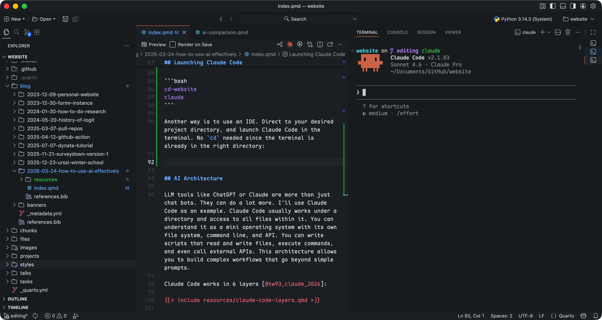

## Motivation

The speed of AI development is overwhelming. Every morning I wake up to news of AI improvements and I don't even have the time to learn and catch up.



I'm both panicked and excited about AI: about how it upends the current software landscape, and how we can use it more efficiently. I'm not sure how AI changes the tech market in the future, but at least for now, I can definitely leverage AI for a workflow tuned to my own needs.

## AI Assistants vs AI Agents

New terms emerge quickly: Vibe Coding, Agentic Engineering, and now Harness Design. These are all trending terms that exist for solid reasons, but before anything else, I want to talk about "AI Assistants" and "AI Agents" since they are the most basic and fundamental concepts.

**AI Assistants** are limited to a single prompt and response. The best example is your conversation with **ChatGPT**, **Claude**, or **Gemini**. You ask a question, it gives you an answer. It is a one-shot interaction.

**AI Agents**, on the other hand, can have multiple rounds of interaction, and they can also execute commands, read and write files, call APIs, and so on. They are more like mini operating systems that can run scripts and workflows. Examples include **Codex**, **Claude Code**, and **Gemini CLI**.

In short, **AI Assistants** are better for one-off questions and tasks. It's your daily companion that can replace Google search. **AI Agents** are better for complex workflows that require multiple steps, decision making, and integration with other tools. They handle project-level tasks.



In this blog post, I am more focused on AI Agents due to their flexibility and power. **Claude Code** is the one that I've been heavily using since its release, and it has become an essential part of my workflow. It allows me to automate tasks, manage projects, and even handle incidents in production.

## Claude Code Basics

[Claude Code CLI](https://code.claude.com/docs/en/overview) can be installed in multiple ways. I prefer Homebrew:

```bash
# Install Claude Code using Homebrew
brew install --cask claude-code
```

The official instructions say that you need to `cd` (change directory, a common `bash` command) to your project directory before using Claude Code:

```bash
# Change to your project directory
cd your-project

# Launch Claude Code
claude
```

This is never emphasized but I think it's the most important step: Yes, you can literally run Claude Code in any directory, but to make your usage more organized and efficient, designating directories is always the first step.

::: {.callout-tip}
Yes, it matters where you launch Claude Code.
:::

There are two types of directories worth knowing:

1. Home directory (`~`), for computer-level tasks. It's convenient but can be destructive if you're not careful. I rarely use it for Claude Code tasks directly, but I keep a `CLAUDE.md` here for global rules and skills that apply across all projects.
2. Project directories, where you `cd` before launching. Each one can have its own `CLAUDE.md` with rules and skills scoped to that project only.



## Launching Claude Code

To launch Claude Code you need a terminal or an IDE. Use an IDE when you want to watch file changes live and edit alongside Claude. For everything else, terminal works fine.

The built-in terminal in MacOS is good enough for most cases, and [VS Code](https://code.visualstudio.com) is a commonly used IDE. I personally use [Kaku](https://github.com/tw93/Kaku) and [Positron](https://positron.posit.co).



To launch Claude Code from your home directory, run `claude` in terminal:

{width=100% fig-align="center"}

To launch Claude Code in a project directory, say I wanna launch it under my website project (where this blog lives), I can `cd` to the project directory and then run `claude`:

```bash
# Change to the project directory
cd /Users/pingfan/Documents/GitHub/website

# Launch Claude Code
claude
```

I use a custom command `cd-website` to make it even simpler:

```bash
cd-website
claude
```

You can also use an IDE: navigate to your project directory and launch Claude Code from its built-in terminal. No `cd` needed.

{width=100% fig-align="center"}

## Architecture of Agentic Engineering

As you launch Claude Code from your desired project directory, you can already start empowering yourself with AI. You are mostly ready, and it's totally okay to close this blog and start your journey of crafting! But to really get into the details and unleash the full potential of AI agents, it's important to understand their architecture, and wisely design your own system.

Again, Claude Code works under your designated project directory and has access to all files within it. This architecture allows you to build complex workflows that go beyond simple prompts. It works whether you start from scratch or pick up an existing project.

I came across [\@tw93](https://x.com/HiTw93)'s article on "How to Build an AI Agentic System with Claude Code" [@tw93_claude_2026], which is a great resource that explains the architecture of Claude Code in detail.

Claude Code works in 6 layers:



A typical Claude Code setup might look like this:

```bash
Project/
├── CLAUDE.md
├── .claude/
│   ├── rules/
│   │   ├── core.md
│   │   ├── config.md
│   │   └── release.md
│   ├── skills/
│   │   ├── runtime-diagnosis/     # Uniformly collect logs, state, dependencies
│   │   ├── config-migration/      # Config migration rollback protection
│   │   ├── release-check/         # Pre-release validation, smoke test
│   │   └── incident-triage/       # Production incident triage
│   ├── agents/
│   │   ├── reviewer.md
│   │   └── explorer.md
│   └── settings.json
└── docs/
    └── ai/
        ├── architecture.md
        └── release-runbook.md
```

[\@tw93](https://x.com/HiTw93) has wrapped all these into a Claude skill called `claude-health` [@tw93_claude_health_2026] and can be installed with a single command:

```bash
npx skills add tw93/claude-health -a claude-code -s health -g -y
```

Worth reading if you want to understand the architecture. Or just install the skill and go from there.

## Vibe Coding, Agentic Engineering, and Harness Design

Workflows have changed since LLMs arrived. The first wave was Vibe Coding: you describe what you want, the model generates code, you hope it works. The outputs were unpredictable, and even when something came out right, you couldn't reliably get there again.

Agentic Engineering is where I am now. It's more structured: you design agents with specific rules and skills, and they handle complex tasks in a reproducible way. Harness Design or Harness Engineering is the latest framing, and Anthropic wrote about it recently [@anthropic_harness_2026].

The name keeps changing, but the shift is the same. You stop handcrafting every piece and start conducting: set the rules, build the skills, let the agents handle the execution.


