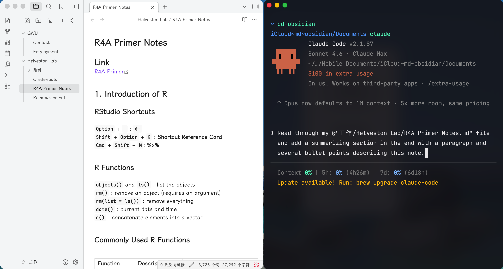
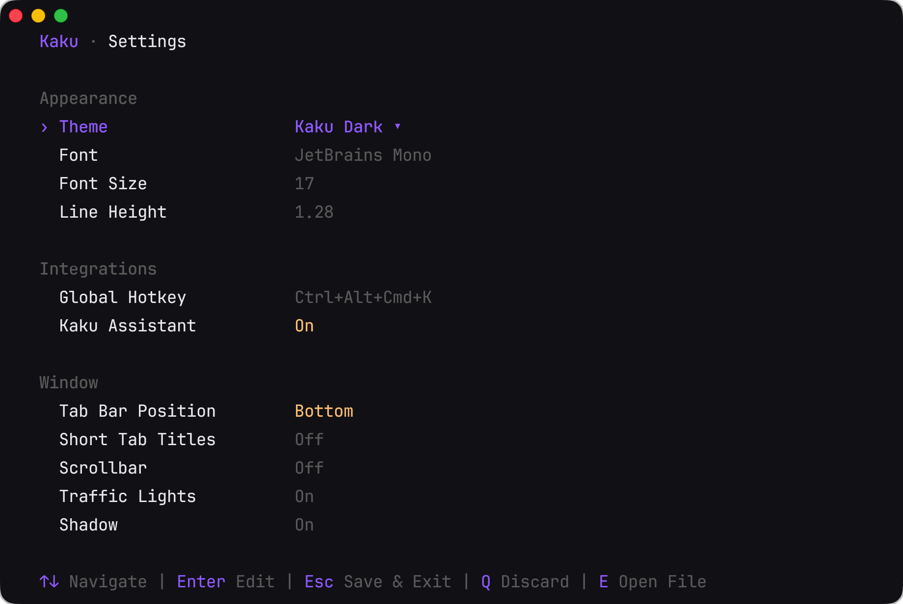
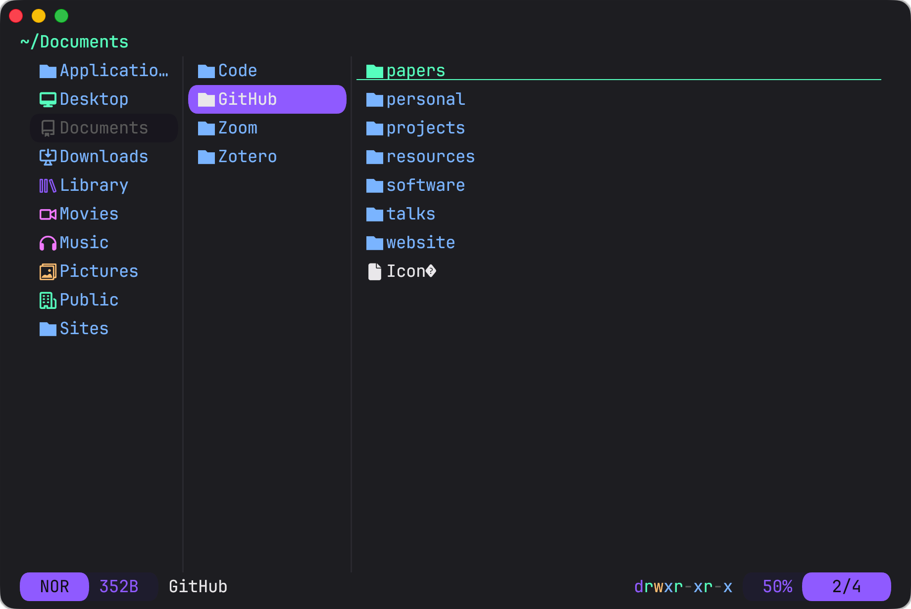

## Software

### Obsidian

[Obsidian](https://obsidian.md/) is a note-taking app supporting `.md` files and real-time rendering. A free account allows you to store your vaults in your iCloud. I use it in combination with Claude Code (and my `cd-obsidian` quick command). You can use Obsidian for multiple purposes: knowledge base, quick notes, future plans, writing, etc.

<figure style="margin: 1rem 0;">
  
  <figcaption style="text-align: center; color: #6c757d; font-size: 0.875em; margin-top: 0.5rem;">Obsidian (left) with Claude Code in Kaku terminal (right)</figcaption>
</figure>

Above is a screenshot of my Obsidian workflow with Obsidian on the left and Claude Code on the right (summoned using the [Kaku](https://github.com/tw93/Kaku) terminal). I use `cd-obsidian` to quickly jump into my Obsidian vault, and then I can talk with Claude Code to read my file(s), write new content, or restructure the current content. The `.md` file type is probably the easiest for LLMs to reach and modify, and since it's all local (and no MCPs involved), it saves tokens and is more secure.

### Spokenly

[Spokenly](https://spokenly.com/) is a tool that converts text to speech. It supports multiple languages and voices, making it a versatile choice for creating audio content from written text. I've been heavily using it both on my Mac and my phone. It largely replaces hand-typing and generates well-structured texts even though sometimes my prompts are a little off.

### Positron

[Positron](https://positron.posit.co) is an IDE published by [Posit](https://posit.co). It's especially handy for data science projects, but not limited to that. I write this blog post with Positron as well. It's a [VS Code](https://code.visualstudio.com)-like IDE, supporting all features of VS Code, like extensions, shortcuts, file management, etc. The best part that I like it is that I can easily have my editor and terminal side-by-side, plus a few more functional pabels like console and data viewer.

<figure style="margin: 1rem 0;">
  
  <figcaption style="text-align: center; color: #6c757d; font-size: 0.875em; margin-top: 0.5rem;">Positron layout: editor and file panel (left) with Claude Code terminal (right)</figcaption>
</figure>

Above is a screenshot of my Positron layout, in which my file management and working space are on the left, and Claude Code is running in the terminal panel on the right.

### Kaku

[Kaku](https://github.com/tw93/Kaku) is an open-source terminal app for macOS with lots of built-in tools and easy shortcuts. You can easily open several tabs and split to different views in one tab. Once you are familiar with the shortcuts, everything is just a few keystrokes away.

<figure style="margin: 1rem 0;">
  
  <figcaption style="text-align: center; color: #6c757d; font-size: 0.875em; margin-top: 0.5rem;">Kaku settings</figcaption>
</figure>

Kaku supports a wide range of settings and can be triggered using the `kaku config` command. You can also cooperate with Claude Code to directly edit the related setting files like `starship.toml` and `yazi.toml`. If you are not familiar with these files just ask Claude Code.

<figure style="margin: 1rem 0;">
  
  <figcaption style="text-align: center; color: #6c757d; font-size: 0.875em; margin-top: 0.5rem;">Kaku Yazi plugin for file management</figcaption>
</figure>

Kaku supports [Yazi](https://yazi-rs.github.io), a TUI for file management, triggered by the `y` command. The original Yazi plugin can only **preview** the directory and files. I did a customized command called `yy` to `cd` to the selected directory upon quitting Yazi. This can be easily done with Claude Code.

<figure style="margin: 1rem 0;">
  
  <figcaption style="text-align: center; color: #6c757d; font-size: 0.875em; margin-top: 0.5rem;">Kaku with multiple tabs and split panels</figcaption>
</figure>

Kaku also supports multiple tabs and panels. In the above example, I opened an Obsidian tab and a GitHub tab, and have 3 panels in the Obsidian tab.

## Extensions

Both Claude and Claude Code support extensions, including **Plugins**, **MCPs** (connectors), and **skills**.

- **Plugins**: marketplace bundles that extend Claude Code with new skills, MCP servers, and configuration. You install them via `/plugin` and they are managed locally.
- **MCPs** (**connectors** as in the Claude app): external servers that give Claude access to real-time tools and data, such as browsing the web, reading a calendar, or querying a database. **MCPs** can be standalone or bundled in **plugins**.
- **Skills**: slash commands (e.g. `/commit`, `/review`) that encode reusable workflows as prompt templates. They are stored as `.md` files and invoked by name to trigger a structured sequence of steps. Likewise, **skills** can also be standalone or bundled in **plugins**.

### Plugins

The [everything-claude-code](https://github.com/affaan-m/everything-claude-code) **plugin** is perhaps the most popular one in the community. It bundles a lot of useful tools, including MCPs, skills, rules, hooks, etc. - pretty much every layers or components described in my previous posts.

The [claude-plugins-official](https://github.com/anthropics/claude-plugins-official) **repo** contains all the official plugins released by Anthropic. I installed `claude-md-management`, `code-review`, `code-simplifier`, and `context7`.

### MCPs (Connectors)

The [Excalidraw](https://excalidraw.com) MCP lets Claude create and edit diagrams directly in Excalidraw — useful for quickly sketching system designs or flow charts without leaving your workflow.

The [Figma](https://www.figma.com) MCP gives Claude read access to your Figma files, so it can inspect designs, extract layout details, and generate code that matches your UI specs.

The [TinyFish](https://www.tinyfish.ai) MCP enables Claude to run browser automation tasks — filling forms, scraping pages, or interacting with web UIs — without you needing to write a script.

There are also simpler MCPs like Gmail and Google Calendar provided by Google that help fetch your emails and calendar events. With these MCPs, you can ask Claude Code to check your schedule, summarize your daily emails, make to-do lists, and so on.

These above MCPs are available for both Claude app and Claude Code.

### Skills

While you install plugins, you might already have access to lots of skills. Skills might be auto-triggered when Claude Code detects the related scenario, or you can use the slash command to trigger them. For example, with the `code-review` plugin, you can trigger the `/review` skill to review your code and get suggestions for improvement, or you can just ask Claude Code to review your code and it will automatically trigger the skill.

[\@tw93](https://tw93.fun) has recently released a collection of skills called [Waza](https://github.com/tw93/waza), which includes 8 skills: `/think`, `/design`, `/check`, `/hunt`, `/write`, `/learn`, `/read`, and `/health`.

From his [blog post](https://tw93.fun/en/2026-04-06/learn.html) and X posts, I summarized that [\@tw93](https://tw93.fun) has 2 principles for designing these skills:

1. Less is more: Different from `everything-claude-code`, which tries to be all-inclusive, Waza leaves more blank space and gives more freedom. Users have to engage more with Claude Code. Also, since skills should be actively triggered (even though sometimes Claude Code can detect and auto-trigger), keeping the skill names simple, and decreasing the number of skills can make it easier to remember and use them.
2. Negative examples: LLMs usually tend to be broad, which makes lots of skills "generally useful" but lacking precision. A "not to" skill design can eliminate the false positives and make the skill more targeted. This is by far rarely been used in other skill designs, but I believe this is a very sharp insight and will make future skill design more effective.

## My past experiences

I wanna use this section to briefly share my developing experiences throughout the past few years in my PhD career. I started learning programming in the pre-LLM era, did my first PhD project in 2023 during which time LLMs are not so smart and inclusive, and watched my workflow evolved in these years.

### Pre-LLM

At this stage, I have been heavily focusing on handcrafting code and structuring the directories on my own. As there is no AI to ask, I usually go to [Stack Overflow](https://stackoverflow.com) to seek good responses. Since I need to take care of everything on my own, I am also a project manager, which means I must manually allocate the resources, files, data, and output. Because I am reviewing on my own as well, these files should be well allocated in a decent way. I treasure this experience because I learned about project planning, progress tracking, and my own way of allocating resources and files. Throughout the years, my project management ability has grown, and now it is one of the most important abilities I have, even with the LLMs.

### Early LLMs

In 2024, ChatGPT and Claude are already available and have been pretty helpful as chatbots. The problem with them is that they are only chatbots, and every time I open a new session, I need to reiterate everything. I trained myself to precisely describe my needs. Every time I make progress with my projects, I will try to condense it into a hundred words describing what the project is, what has been done, and what I want to do later on.

A strong reason that makes me lean toward Claude is that Claude introduced a new capability called Projects. I am free to open any new project, which includes a set of files and fixed prompts. Every time I open a new session within this project, all the pre‑stored files and prompts are included as well. I do not need to repeatedly describe what I want or repeatedly feed Claude my files. That was also the time the term "context" began to emerge for LLM users and developers. People realized how important it was that context ensures a consistent conversation session with LLMs.

### Agentic engineering now

In 2025, Claude Code was released, and I immediately started using it after I learned how it works: I designate a working directory, and start my conversations with Claude Code. Having a predefined working directory makes it really efficient when talking with LLMs because your context is all the files under your working directory.

Later, Anthropic started to build more capabilities for Claude Code because all we need to do is add the files and regulations under the directory. There are also some global settings under my home folder. That is why I emphasized that there are two types of directories for Claude Code: one, your working directory; two, your home folder.

All the extensions, both for Claude App and Claude Code, including the plugins, skills, MCPs, and hooks, are constructed under the same spirit: your working directory or home directory as the context manager and the designated places for these extensions to fit in.

This is the whole picture of agentic engineering right now. Rather than doing everything on your own, you are a project manager, or you are running an orchestra. You are in control of everything, but there is no need for you to handcraft it because you have a super powerful assistant.

### Conclusion

Thanks to my learning path, I learned the importance of managing directories, files, and resources, and the differences between chat bots and agentic engineering. Even though you do not have to go through all of them right now, it doesn't hurt to know these differences and how important it is to manage your files.