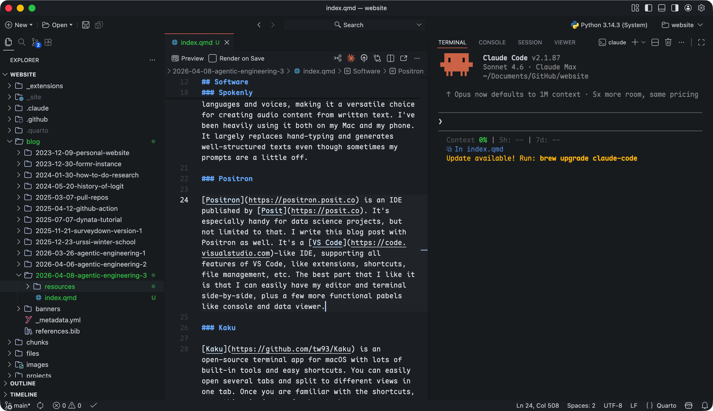
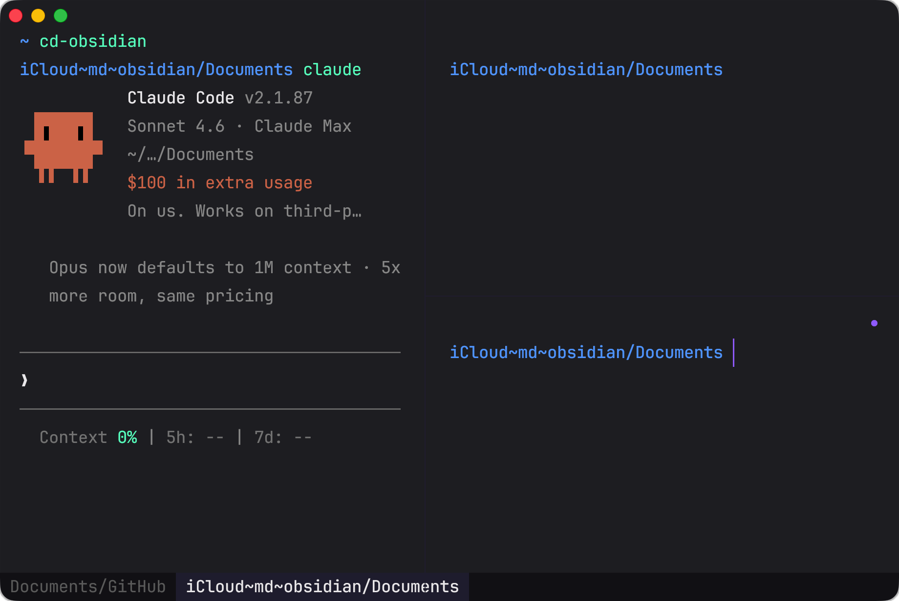

## Software



### Obsidian

[Obsidian](https://obsidian.md/) is a note-taking app that stores everything as `.md` files with real-time rendering. A free account syncs your vaults to iCloud. I pair it with Claude Code using a `cd-obsidian` quick command. It works for almost anything: knowledge base, quick notes, plans, drafts.

<figure style="margin: 1rem 0;">
  
  <figcaption style="text-align: center; color: #6c757d; font-size: 0.875em; margin-top: 0.5rem;">Obsidian (left) with Claude Code in Kaku terminal (right)</figcaption>
</figure>

I use `cd-obsidian` to jump into my vault and work with Claude Code directly: reading files, drafting new content, or restructuring what's already there. Plain `.md` files are the easiest format for Claude to read and edit. Since everything stays local with no MCPs involved, it uses fewer tokens and keeps your notes private.

### Spokenly

[Spokenly](https://spokenly.app) converts text to speech and supports multiple languages. I use it daily on both my Mac and phone. It largely replaces hand-typing and produces well-structured texts. This blog post, and also the previous ones, are in fact constructed with great help from Spokenly.

### Positron

[Positron](https://positron.posit.co) is an IDE from [Posit](https://posit.co), built for data science but comfortable for general development. I'm writing this post in it. It runs on [VS Code](https://code.visualstudio.com)'s foundation, so extensions, shortcuts, and file management all work the same way. What I value most is having the editor, terminal, console, and data viewer open at the same time without switching windows.

<figure style="margin: 1rem 0;">
  
  <figcaption style="text-align: center; color: #6c757d; font-size: 0.875em; margin-top: 0.5rem;">Positron layout: editor and file panel (left) with Claude Code terminal (right)</figcaption>
</figure>

The file panel and editor sit on the left; Claude Code runs in the terminal on the right. Having both visible at once cuts a lot of context switching.

### Kaku

[Kaku](https://github.com/tw93/Kaku) is an open-source terminal for macOS with built-in tools and customizable shortcuts. You can open multiple tabs and split any tab into panels. Once you learn the shortcuts, most actions take two or three keystrokes.

<figure style="margin: 1rem 0;">
  
  <figcaption style="text-align: center; color: #6c757d; font-size: 0.875em; margin-top: 0.5rem;">Kaku settings</figcaption>
</figure>

Kaku's settings are accessible via `kaku config`, and you can ask Claude Code to edit configuration files like `starship.toml` and `yazi.toml` directly.

<figure style="margin: 1rem 0;">
  
  <figcaption style="text-align: center; color: #6c757d; font-size: 0.875em; margin-top: 0.5rem;">Kaku Yazi plugin for file management</figcaption>
</figure>

Kaku includes [Yazi](https://yazi-rs.github.io), a terminal file manager triggered with the `y` command. Out of the box, Yazi only previews files and directories. I wrote a custom command `yy` that changes to the selected directory upon quitting. Claude Code set it up in a few seconds.

<figure style="margin: 1rem 0;">
  
  <figcaption style="text-align: center; color: #6c757d; font-size: 0.875em; margin-top: 0.5rem;">Kaku with multiple tabs and split panels</figcaption>
</figure>

The screenshot above shows two tabs, Obsidian and GitHub, with three panels open inside the Obsidian tab.

## Extensions



There is no official name for the installable contents to LLMs, and I call them extensions. Both Claude and Claude Code support extensions, including **Plugins**, **MCPs** (**connectors**), and **skills**.

- **Plugins**: marketplace bundles that extend Claude Code with new skills, MCP servers, and configuration. You install them via `/plugin` and they are managed locally.
- **MCPs** (**connectors** as in the Claude app): external servers that give Claude access to real-time tools and data, such as browsing the web, reading a calendar, or querying a database. **MCPs** can be standalone or bundled in **plugins**.
- **Skills**: slash commands (e.g. `/commit`, `/review`) that encode reusable workflows as prompt templates. They are stored as `.md` files and invoked by name to trigger a structured sequence of steps. Likewise, **skills** can also be standalone or bundled in **plugins**.

### Plugins

The [everything-claude-code](https://github.com/affaan-m/everything-claude-code) plugin is one of the most popular in the community. It bundles MCPs, skills, rules, and hooks, covering most of what I described in the previous posts.

The [claude-plugins-official](https://github.com/anthropics/claude-plugins-official) repo contains the official plugins Anthropic has released. I use `claude-md-management`, `code-review`, `code-simplifier`, and `context7`.

### MCPs (Connectors)

::: {.callout-important}
MCPs consume tokens faster. Use wisely!
:::

The [Excalidraw](https://excalidraw.com) MCP lets Claude create and edit diagrams in Excalidraw, useful for sketching system designs or flow charts without switching apps.

The [Figma](https://www.figma.com) MCP gives Claude read access to your Figma files, so it can inspect designs, extract layout details, and generate code that matches your UI specs.

The [TinyFish](https://www.tinyfish.ai) MCP lets Claude run browser automation tasks (filling forms, scraping pages, interacting with web UIs) without you writing a script.

There are also some more commonly used MCPs like Gmail and Google Calendar. With them, you can ask Claude Code to check your schedule, summarize emails, or build a to-do list from your inbox.

::: {.callout-tip}
MCPs are not only limited to LLMs. Obsidian, for example, supports plugins that connect to MCPs as well. A good example is the Excalidraw plugin.
:::

### Skills

When you install plugins, you often get skills bundled with them. Claude Code can auto-trigger skills when it detects the right context, or you can invoke them with a slash command. With the `code-review` plugin, for example, `/review` runs a code review, but you can also just ask Claude Code to review your code and it picks up the skill on its own.

[\@tw93](https://tw93.fun) recently released a collection of skills called [Waza](https://github.com/tw93/waza), which includes eight skills: `/think`, `/design`, `/hunt`, `/check`, `/write`, `/learn`, `/read`, and `/health`.



From his [blog post](https://tw93.fun/en/2026-04-06/learn.html) and X posts, he describes two design principles:

1. **Less is more.** Unlike `everything-claude-code`, which aims to cover everything, Waza deliberately leaves room for you to engage. Fewer skills with shorter names means less to memorize and easier recall when you need them.
2. **Negative examples.** LLMs tend to be broad, which makes many skills "generally useful" but imprecise. Building skills around what they should *not* do cuts false positives and sharpens targeting. Few skill designers use this approach, but I believe this is a great insight.

## My Journey



### Pre-LLM

Back then, I wrote every line by hand and organized every directory myself. [Stack Overflow](https://stackoverflow.com) was the go-to when I got stuck. Managing everything alone meant thinking like a project manager: track progress, allocate files, plan ahead. That habit stuck. Project management is still one of the more useful skills I have, even now that Claude handles most of the implementation.

### Early LLMs

In 2024, ChatGPT and Claude were useful as chatbots but had a real limitation: each new session started from scratch. I had to re-explain everything. I trained myself to write a tight project summary, around 100 words, covering what the project was, what was done, and what came next. I'd paste it at the start of every session.

What kept me leaning to Claude was Projects. You can store files and a fixed prompt inside a project, and they load automatically in every new session. No more re-explaining. That was when "context" became a trending term. Consistent context meant a consistent conversation.

### Agentic Engineering

Claude Code launched in 2025. The model is simple: designate a working directory, and your context becomes every file inside it. That makes conversations much more grounded than a blank chatbot session.

Anthropic kept adding capabilities because the model scales naturally: add files and configuration to the directory, and Claude Code picks them up. Two directories matter: your working directory for the current project, and your home folder for global settings.

Every extension, whether plugins, skills, MCPs, or hooks, follows the same logic: files live in either your working directory or your home folder, and Claude Code picks them up from there.

That is agentic engineering in practice. You are the project manager: setting direction, reviewing output, deciding what comes next. Claude handles the implementation.

### Conclusion

That path taught me two things that still shape how I work: file management matters more than it looks, and there is a real difference between chatting with an AI and building a workflow around one. Understanding both will make you more effective with any AI tool.
