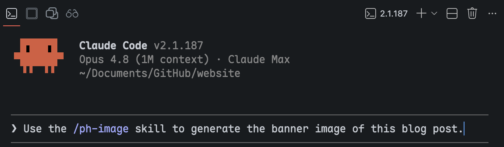

## Motivation

Much of my daily work consists of tasks I perform repeatedly: image generation, document formatting, html content creation, app development, etc. Each repetition re-issues essentially the same instructions to an agent, which is wasteful. A **skill** eliminates that waste by encapsulating the workflow once and invoking it by name thereafter.

In my previous blog post of [Agentic Engineering - Part 1](/blog/2026-03-26-agentic-engineering-1/#architecture-of-agentic-engineering), I summarized there were 6 layers in Claude Code (as well as other AI agents), but agentic **skill** is the one that I engage with most often. Having practiced agentic skills for over a month, I decided to write out this blog post to share my experience.

## Skill Usage

When you have a skill installed on your computer, whether you developed it or downloaded it online, you need to invoke the skill using the forward slash (`/`) command. For example, I have a `ph-image` skill that generates images with a consistent style for my blog posts, and I invoke it by typing `/ph-image` in the chat interface (there will be color effect on the command text). The agent then recognizes the command and executes the workflow defined in the skill.

<figure style="margin: 1rem 0;">
 
 <figcaption style="text-align: center; color: #6c757d; font-size: 0.875em; margin-top: 0.5rem;">Invoking the <code>/ph-image</code> skill in Claude Code with a single short request.</figcaption>
</figure>

Internally, in the skill, what happens is that there is a master `SKILL.md` file that regulates the basic work setup: the general taste of the output, the available APIs, and the conversion of my simple prompt into a more sophisticated prompt that feeds into the image generation model via the selected API. The skill encapsulates script files and templates to support the workflow.

Why make it a skill? This complicated workflow was designed once and proved useful, but I do not want to redesign it repeatedly. Therefore, the entire workflow and setup is encapsulated into a skill. Every time I need to perform the same sequence of tasks, I simply invoke this skill.

You can see the result across my site: every banner on these pages was generated by `/ph-image`, which keeps them in one consistent visual family. Click through to browse them.



## Installing Skills

Skills for general purposes, like editing, coding, or reading, are better installed from the open-source market. These 2 sources are what I use the most:

- [Everything Claude Code](https://github.com/affaan-m/ecc) (ECC): an expansive, all-inclusive plugin whose own README advises selective installation.
- [Waza](https://github.com/tw93/Waza): a deliberately minimal set of eight skills covering the common cases of general development, both coding and otherwise.

However, other than general purposes, there are many cases where you need to establish your own workflow, which may be totally different from other use cases. In this case, authoring a skill that specifically suits your workflow becomes a necessity.

In short, everything about a skill can be split into three categories: installing a skill, authoring a skill, and using a skill. That's all. Now, let's talk about skill authoring. By performing skill authoring, you can also better understand how a skill works and how to improve it in the future to better fit your needs. 

## Authoring Skills

### Skill with Minimal Form

At minimum, a skill is a directory bearing the skill's name and containing a single `SKILL.md` file:



Minimal in form does not imply minimal in function. My `/ph-html` skill only has the `SKILL.md` file, yet it consistently produces every styled HTML component across my blog posts and slides, including those in this post.

All my personal skills start with `ph-` which is my initial. This is only my personal preference, but one good thing about this habit is that inside the `skills/` folder, all skills that I authored myself are together.

`SKILL.md` comprises a YAML header and a body. The YAML header declares the skill's `name` and a `description`. The body is the prompt loaded into context on invocation, stating the rules, conventions, and examples the agent is to follow. The structure is simplified as this:

````markdown
---
name: ph-html
description: Generating styled HTML components for Quarto blog posts.
  Five component types: intro-links, button-table, table, icon-grid, url.
---

# Skill: ph-html

Use this skill when generating styled HTML components for Quarto blog posts.

## Common Conventions

- All styles live in `styles/styles.scss`. Never add `<style>` blocks.
- Use 1-space indentation per level in HTML.

## intro-links

A centered row of pill buttons near the top of a post.

```html
<div class="intro-links">
  <a href="..." class="intro-btn">Website</a>
</div>
```
````

### Skill with Complex Structure

A skill can be more than just a master `SKILL.md` file. It can also carry templates and resources, and the reason is rooted in how language models behave. An LLM is inherently stochastic: given only an instruction file such as `SKILL.md`, the output might have variation each time which might not be what we want. Solidified resource files (code scripts, stylesheets, templates, shell commands, etc.) can be used as supportive artifacts that ensures the consistency of the output.

My `/ph-slide` skill is built on this principle. Alongside the main `SKILL.md`, it ships two folders of resources:

- `assets/` holds the deterministic building blocks: a shared stylesheet, the deck configuration, and a render script.
- `template/` is a complete Quarto slide project that serves as a working template to copy and adapt.



A Quarto slide project involves several file types: `.qmd` files as main source, `.scss` as styling, `.yml` as configuration, and `.html` as partials. Feed the structure as a template in the skill and configure the skill to understand the entire workflow; then we can invoke the skill to consistently build stable portal slide output.

My "2026 Summer Workshop - Agentic Workflows with Claude Code" slides are made using the `/ph-slide` skill. It is a good example of how to efficiently make slides with consistent theme and taste:



### Skill with Nested Agents

It's impossible for one agent to be good at everything. A good solution is to call another agent that is better at a specific task inside your currently working agent, so that your working scope, including your context and setup environment, is still managed by your master agent, but only the specific task is handled by another agent.

My `/ph-image` skill is an example of this. Claude Code is the master agent that I use as a production agent, but it has no image model of its own, while Gemini has really good image generation capabilities. So here is the workflow:

1. I give a prompt to Claude Code about the image I want to generate with a consistent theme, color, taste, and styling.
2. Claude Code helps me create another prompt, which is more sophisticated and better suited to Gemini's ability. This new, enhanced prompt is sent to Gemini through the API.
3. Gemini generates the image and returns it to Claude Code.
4. Claude Code reviews it to ensure the generated image is correct and functional. Otherwise, it automatically passes the request back to Gemini until a satisfactory result is produced.
5. The final result is then returned to me.

In most cases, this works automatically without my intervention. The skill's main value is that it allows me to leverage the strengths of both agents without leaving my context. I stay in the loop, and the agents handle the tedium of prompt engineering and API calls.

A possible expansion of this skill is that I can also introduce other image generation models, for example, GPT, so that I can invoke the corresponding APIs accordingly. Here's a quasi-structure of the skill:



We have a main `SKILL.md` file that holds the high-level regulations for the skill, then three independent Python scripts: one for prompt generation, two for Gemini/GPT invocation. 

### The Randomization and Determinism of a Skill

At their core, large language models are probability machines. Every output is sampled rather than computed, so a degree of randomness is baked into everything an agent makes. Ask an image model to draw an apple and you see it plainly: prompt Gemini ten times and you get ten apples, no two alike. That variation is the model working as designed.

Skills inherit this randomness. If a skill is only an instruction file, the agent rebuilds its output from scratch on every run, and the result drifts between invocations. Sometimes that is welcome; often it is not. A banner should match its siblings, and a label should read the same way every time. Determinism is therefore something you build into a skill on purpose, and there are two reliable ways to do it: keep templates as fixed examples for the agent to copy rather than regenerate (I store mine in a `resources/` folder, though `assets/` works just as well), and lean on scripts for the pre- and post-processing steps that must never vary.

The two ingredient icons below show both ideas at once.



Each started as a Gemini generation and then passed through a Python post-processing step run by Claude Code, and each carries two kinds of determinism. The first is the label: the text at the bottom is not drawn by Gemini but written as plain text and composited on afterward. Image models are notoriously unreliable with text, so moving the words into a script means they are never garbled and never wrong. The second is the bottle itself. The glass, the cork, and the framing are identical across both icons; only the liquid changes in color and texture. That comes from an image-to-image pass against a reference I saved into the skill, so every future ingredient of this kind is generated from the same styling.

The payoff is what the reader never has to notice. On a recipe page the ingredient icons feel like a matched set drawn by one hand, even though each was generated on its own. The randomness stays where it belongs, in the liquid that should differ, while everything that should hold still is pinned down by a template and a script.

### Skill with Bundled Workflows

A good practice when designing a skill for an entire project is to design a single skill that embraces as many aspects of the project as possible. I have two clear reasons for that:

1. From the user's perspective, invoking the skill requires recalling its name, which is inefficient for users to memorize many skill names. One skill name for all is more than enough.
2. How a skill works is that the AI agent will first read through the master `SKILL.md` file. Even though a skill might have multiple aspects, the AI agent is smart enough to understand the task and the content inside the skill and selectively pick the related files. The token consumption is considerably small. 

My `/surveydown-skill` is a good example. The [surveydown](https://surveydown.org) platform is an open-source survey engine built with R, Quarto, Shiny, and PostgreSQL. Me and my advisor, [Dr. John Helveston](https://www.jhelvy.com), both care a lot about user experience and learning curve. The implementation of this skill is also for this same purpose.

Currently, the skill contains these capabilities: creating a survey, connecting a database to store responses, deploying the survey online, and recording a video walkthrough, and each is a full workflow rather than a loose hint.



## Closing Thoughts

Strip away the details and a skill is just a command you summon with a forward slash. The only hard requirement is the `SKILL.md` file; everything beside it is optional, and the author is free to put in whatever the workflow needs. Across this post that freedom took a few recurring shapes:

1. **Start minimal:** A single `SKILL.md` is enough. Its description and examples set the basic tune, and they deliberately leave room for the model to vary.
2. **Deterministic Parts:** Scripts (Python, shell, R) and fixed templates make the deterministic parts reproducible, while the prose stays free to improvise.
3. **Bundled Workflows:** One skill can hold several distinct abilities, as long as they share a theme.
4. **Nest other agents:** A skill can wrap another model's API, so your main agent delegates the tasks it is weak at; image generation, where Claude Code turns a loose prompt into a sharp one for Gemini or GPT, is the clearest example.

In the end, I want to emphasize a conceptual thing. The reason why we need a skill is not for the AI agent's benefit, but for the human users. The AI agents do not care whether they use a skill, and they do not distinguish between a skill and a temporary prompt, because the agents only read files, contexts, and prompts wherever they are. The reason we create a skill is to encapsulate a fixed workflow, which may be deterministic or extensive, based on our needs. My personal experience might not be the best practice, but it is a good way to start and is also a summarization of my close engagement with AI agents over these several months. I hope my experience can be beneficial to you and other developers interested in using AI agents. Cheers~
